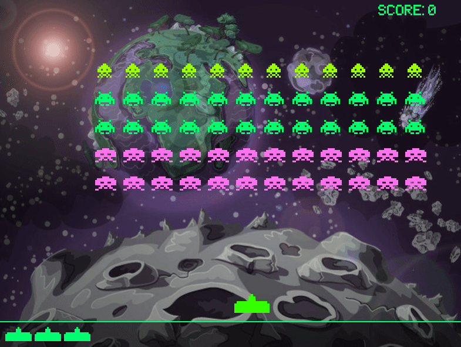

## Space Invaders Pygame

This is an old project I made back in 2019 when I was learning python. It is a remake of the arcade classic space invaders using pygame with lots of color and some funky sound effects. It is not very authentic to the original. :smile:

## Installation

Clone the repo and just run the script with python. It requires pygame be installed on your system as the script imports the module upon entry.

## Credits

- All sprites are made by myself. I give permission for them to be used without
  restriction, with the exception being the background, which is not my work.
- All sound effects and music are not my own, rather they were sourced from
  freesound.org, thus are subject to their own liscenses.
  
